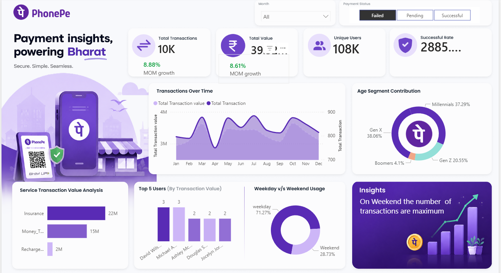

# 📊 PhonePe Payment Insights Dashboard | Power BI

## 📌 Project Overview
The PhonePe Payment Insights Dashboard is an interactive Power BI dashboard developed to analyze digital payment transactions and generate meaningful business insights. It enables stakeholders to monitor transaction performance, payment value, user activity, payment success rate, and customer behavior through interactive visualizations.

---

## 🎯 Business Objective

The primary objectives of this dashboard are to:

- Monitor overall payment performance.
- Analyze monthly transaction trends.
- Track transaction value and unique users.
- Understand customer demographics.
- Compare weekday and weekend transaction behavior.
- Identify high-value services and top-performing users.
- Support data-driven business decision-making.

---

## 🛠️ Tools & Technologies Used

- Microsoft Power BI
- Power Query
- DAX (Data Analysis Expressions)
- Data Modeling
- Microsoft Excel

---

## 📈 Dashboard Features

### ✅ KPI Cards
- Total Transactions
- Total Transaction Value
- Unique Users
- Successful Transaction Rate
- Month-over-Month (MoM) Growth

### 📅 Transaction Trend Analysis
Visualizes monthly transaction volume and transaction value to identify growth patterns, seasonal trends, and business performance over time.

### 👥 Age Segment Contribution
Shows the percentage contribution of Gen Z, Millennials, Gen X, and Boomers to overall transactions.

### 💳 Service Transaction Value Analysis
Compares transaction values across different service categories such as Insurance, Money Transfer, and Recharge, helping identify the highest-performing services.

### 🏆 Top 5 Users
Highlights the top five users based on transaction value, enabling businesses to identify their most valuable customers.

### 📆 Weekday vs Weekend Usage
Compares customer transaction activity during weekdays and weekends to understand user engagement patterns.

### 🎛️ Interactive Filters
Allows users to filter the dashboard by Month and Payment Status for dynamic analysis.

---

## 💡 Key Business Insights

- Processed over **10K transactions** with a total transaction value of **39.32 Million**.
- Served more than **108K unique users**.
- Insurance generated the highest transaction value among all service categories.
- Millennials and Gen X contributed the largest share of overall transactions.
- Weekend transaction activity was significantly higher than weekday activity.
- Monthly transaction trends indicate stable platform performance with consistent user engagement.

---

## 📂 Repository Contents

- PhonePe Payment Dashboard.pbix
- Dataset.xlsx
- Dashboard Screenshot.png
- README.md

---

## 📷 Dashboard Preview

---

## 🚀 Conclusion

This dashboard demonstrates how Power BI can transform raw payment transaction data into actionable business insights. By combining KPI monitoring, customer segmentation, trend analysis, and interactive filtering, the dashboard supports informed business decisions and enhances performance analysis.

---

